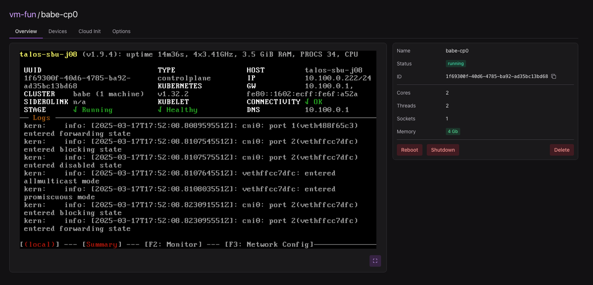

# Rockferry

## Not Production Ready

Rockferry is a modern VM orchestration platform designed to provide a robust foundation for virtual private cloud providers. It wraps around [libvirt](https://libvirt.org), a powerful tool for managing KVM virtual machines.

### Why Not Use ESXi or Hyper-V?

A better question might be: why not use libvirt directly? Yes, you could write a Terraform script to communicate with a libvirt host—but who manages the state? Libvirt itself is not an orchestrator; it simply acts as a layer above the hardware hypervisor. While it’s an excellent tool, it lacks built-in orchestration features such as VM migration across nodes or the ability to deploy the same configuration across multiple hosts.

The goal of Rockferry is to provide a rock-solid foundation for seamless infrastructure orchestration. It serves as a bridge between cloud platforms and hypervisors, forming the backbone of data center infrastructure. Rockferry must deliver consistent behavior across multiple nodes while ensuring high availability. A Rockferry instance going offline isn’t an option. That’s why it is designed to be highly available, capable of distributing itself across multiple nodes—similar to a Kubernetes control plane.

Rockferry is not a cloud provider but rather the foundation for one—an essential layer for on-premises cloud platforms.

## Goals

- Support multiple storage backends (iSCSI, NFS, etc.).
- OpenID authentication.
- Node self-registration.
- Clustering of the Rockferry control plane.
- Automated VM migration when a node goes down (only possible with network-backed storage).
- Easy installation and setup.

## Features So Far

- Supports Ceph and Dir as storage backends.
- Create VMs via the Rockferry UI.
- Basic day-2 operations on VMs, such as:
  - Adding and deleting disks.
- Partial synchronization with existing libvirt installations.
- Kubernetes orchestration with Talos—Rockferry can deploy a basic Kubernetes cluster using Talos.
  - No day-2 operations yet.

## Want to Contribute?

Check out the [Contribution Guide](./CONTRIBUTE.MD).
